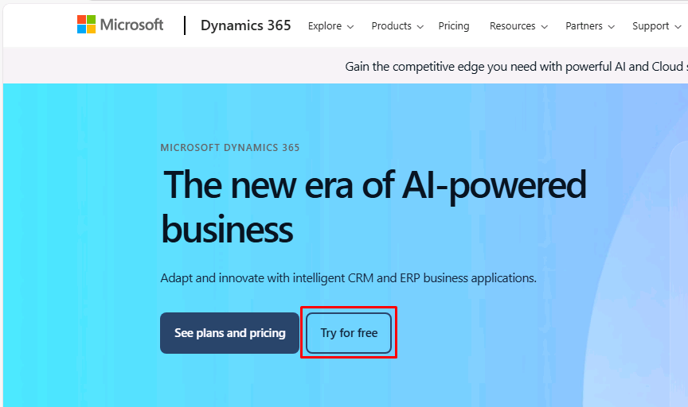
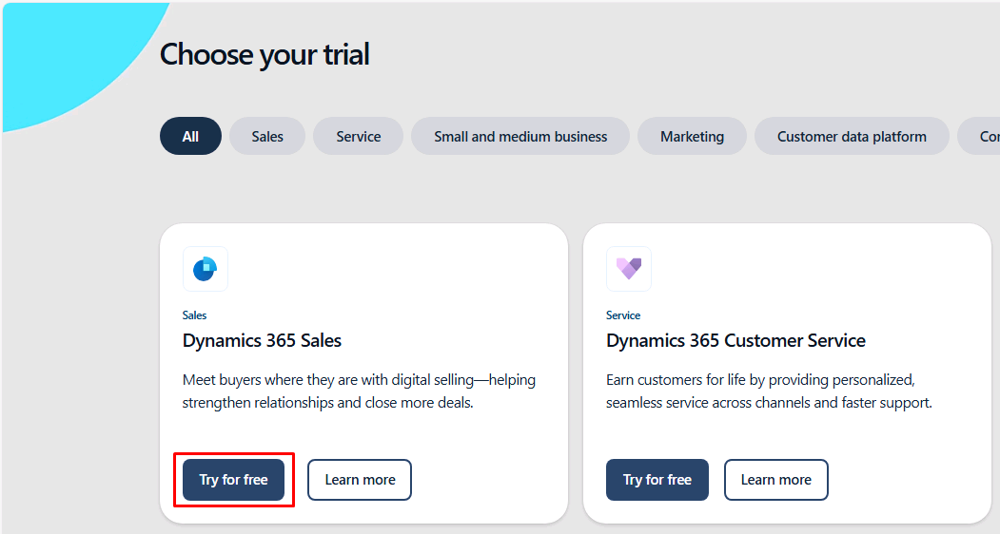
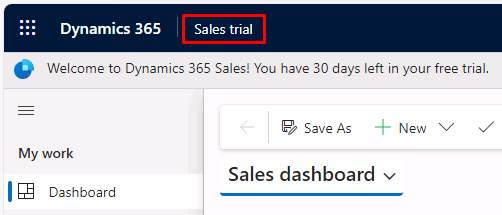
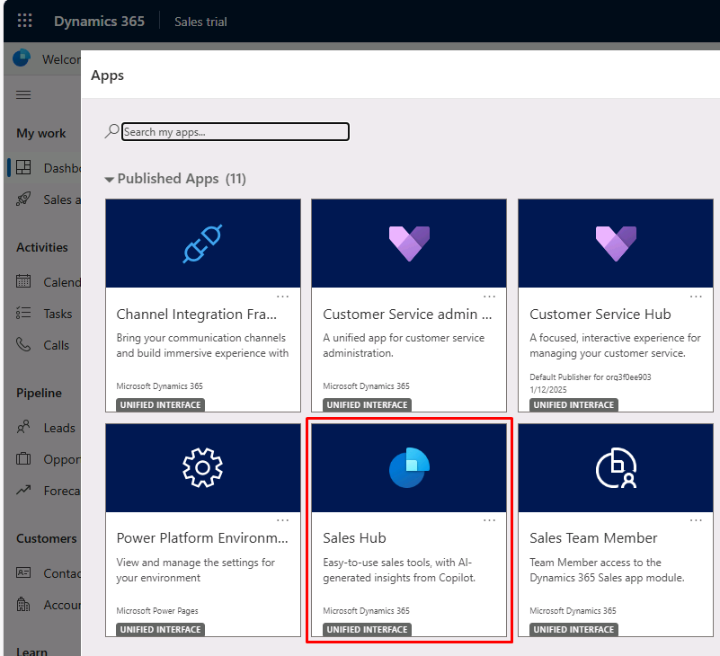

---
lab:
    title: 'Lab 0: Validate lab environment'
---

# TW-7003: Optimize sales processes with Dynamics 365 Sales

## Lab 0 - Validate lab environment

### Scenario
Contoso Coffee produces high-quality coffee and coffee machines, which they retail through channels including new Contoso Retail Stores in premium locations, premium food resellers and the Contoso Coffee Web Site.
Contoso Coffee is looking to formalize their sales process to increase revenue and give leadership, stronger forecasting abilities. You are a functional consultant configuring Dynamics 365 for Sales for Contoso Coffee. In this lab, you'll install the Sales application and install sample data.
This new offering will help them to build direct relationship with their customers and learn more about how customers consume their products.

### Exercise 1 – Access a trial environment

#### Task 1 – Create a Trial

1. In a new browser tab, go to https://dynamics.microsoft.com/dynamics-365-free-trial. 
    
1. Select **Try for free**.

    

1. Locate the **Dynamic 365 Sales** tile and select **Try for free**.

    

1. In the **Let's get started** dialog, enter the credentials that were provided to you as part of your lab environment.

1. Select the checkbox for the terms and agreements, then select **Start your free trial**.

1. When prompted to enter a phone number, enter *0123456789*, then select **Submit** to launch your trial.

1. On the header in the top-left, select **Sales trial**. 

    

    This will open your list of available apps.
    
1. In the **Apps** dialog, select **Sales Hub** to open the application.

    

1. Feel free to take a few minutes to explore the application.

