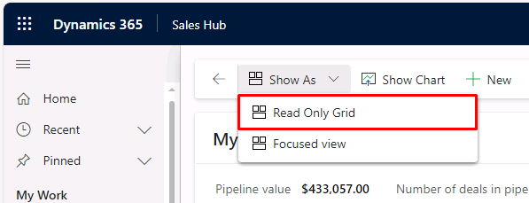
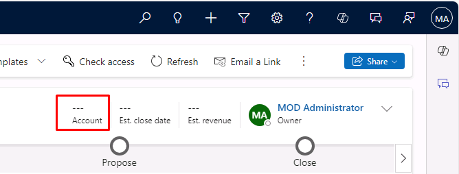
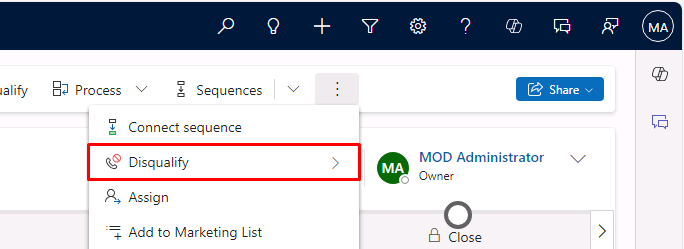
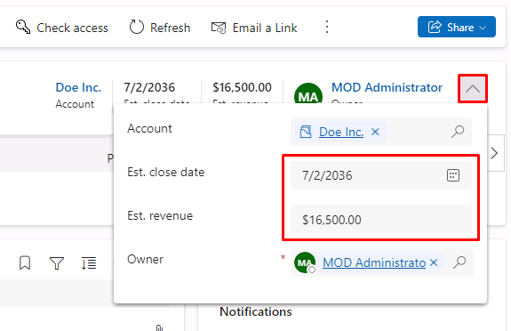
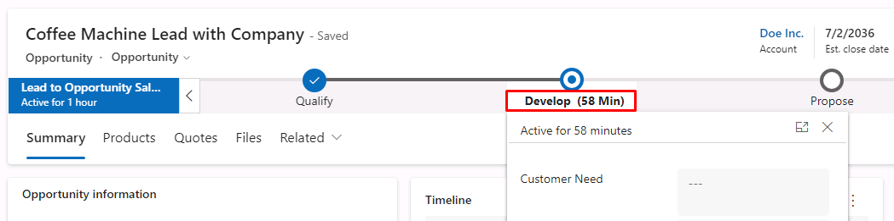
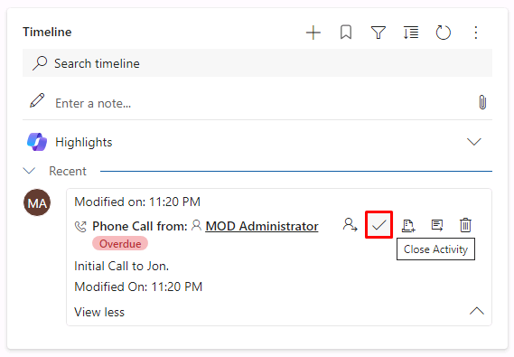

---
lab:
    title: 'Lab 1: Manage leads and opportunities'
---

# TW-7003: Optimize sales processes with Dynamics 365 Sales

## Lab 1 – Manage leads and opportunities

### Scenario
Contoso Coffee is looking to use Dynamics 365 Sales to formalize their sales process as well as address a backlog of untouched leads imported by the marketing team from trade shows and campaigns. As a sales analyst at Contoso Coffee, you have been asked to assess and update lead records to ensure that the executive team is working from an accurate pipeline report in the upcoming leadership meeting.

Upon successful completion of this lab, you will be able to:
- Create and update lead records
- Qualify and disqualify leads
- Reactivate lead records

### Exercise 1 – Manage customers

#### Task 1 – Creating Leads
In this task, you will create three leads, one without company information and two with company information.
1. Go to your Dynamics 365 Sales Hub application. Ensure you are in the Sales area, using the bottom left dropdown menu.
1. In the left navigation, under the **Sales** group, select **Leads**.
1. At the top of the **My Open Leads** pane, select **Read Only Grid** to change the type of view.
1. From the menu that appears, select the **+ New** button on the top command bar.
1. Enter *Coffee Machine Lead Without Company* for Topic, *Jane* for First Name, *Doe* for Last Name.
1. Select the **Save** button on the command bar.
1. On the command bar, select **+ New** again.
1. If prompted to discard suggestions, select the **Do not show again** checkbox, then select **Continue anyway**.
1. Enter *Coffee Machine Lead with Company* for Topic, *Jon* for First Name, *Doe* for Last Name, *Doe Inc.* for Company.
1. Select  **Save**.
1. On the command bar, select the **+ New** button one more time.
1. Enter *Another Coffee Machine Lead* for Topic, *Jack* for First Name, *Rogers* for Last Name, *Test Coffee Shop, Inc.* for Company.
1. Select **Save**.

### Exercise 2 – Lead Qualifications
In this exercise, you will qualify/disqualify leads and see what records will be created when a lead goes through the qualification process.

#### Task 1 – Qualify Coffee Machine Lead Without Company Information
1. In the left navigation, under the **Sales** group, select **Leads**.
1. On the **My Open Leads** pane, select **Jane Doe**.
1. Select **Qualify** from the command bar. The lead will be Qualified into a new Opportunity record.
1. Select **Opportunities** from the left navigation to view all open opportunities. 
1. In the command bar, select **Show As**, then select **Read Only Grid**.

    

1. Select the **Coffee Machine Lead without Company** opportunity. 
1. Locate the **Contact** field. You will find that **Jane Doe** is now a Contact record in the application that you can open.
1. Locate the **Account** field in the header of the opportunity record. Notice that the field is empty.

    

#### Task 2 – Qualify Coffee Machine Lead with Company
1. In the left navigation, select **Leads**.
1. Locate **Jon Doe** and open it.
1. Click **Qualify** from the top menu.
1. Select **Opportunities** from the left navigation to view all open opportunities. 
1. Select the **Coffee Machine Lead with Company** opportunity. 
1. Locate the **Contact** field. You will find that **Jon Doe** is now a Contact record.
1. Locate the **Account** field. You will find that **Doe, Inc.** is now an Account record.

#### Task 3 – Disqualify a Lead
1. In the left navigation, select **Leads**.
1. Locate and select **Jack Rogers** to open the lead.
1. Select **Disqualify** from the command bar. You may need to select the vertical ellipsis button for it to display.

    

1. From the menu that appears, select **No Longer Interested**.
1. The Lead will be Disqualified, the status will change to **No Longer Interested**, and the record will become Read-only.

#### Task 4 – Reactivate A Lead
1. In the left navigation, select **Leads**.
1. The Lead you disqualified is no longer in the **My Open Leads** view. Select the down arrow next to **My Open Leads** and change the view to **Closed Leads**.
1. Locate and select **Jack Rogers** to reopen it.
1. Select the **Reactivate Lead** button on the command bar.
1. The Lead will be reactivated, the status will change back to New, and the record will become editable.

### Exercise 3 – Work with Opportunities
In this exercise, you will walk through the process of working an opportunity through the sales process.

#### Task 1 – Manage the Coffee Machine Lead with Company
1. In the left navigation, select **Opportunities**.
1. Select the **Coffee Machine Lead with Company** opportunity to open it.
1. Enter the following in the **Opportunity information** section:
   - Budget Amount: $17,000
   - Purchase Timeframe: This Quarter
   - Purchase Process: Committee
   - Description: Looking to upgrade their current coffee machines at multiple locations.
1. Expand the record header near the top-right using the down arrow, and enter the following:
   - Est. Close Date: Enter tomorrow’s date.
   - Est. revenue: $16,500

    

1. On the **Timeline** tile, select the **+** (Create a timeline record), then select **Phone call**.
1. Enter the following in the new **Quick Create: Phone Call** pane:
   - Subject: Initial Call to Jon.
   - Due: Enter Today’s Date at 4:30 PM
1. Select the **Save and Close** button.
1. Select the **Develop** stage of the Lead to Opportunity Sales Process flow.

    

1. Enter the following:
   - Customer Need: Looking to upgrade their coffee machines at multiple locations.
   - Proposed Solution: Recommending multiple AirPot Duo Machines.
   - Identify Stakeholders: completed
   - Identify Competitors: completed
1. Select the **Next Stage** button.
1. On the **Propose** stage, set all the fields to **Completed**.
1. Select the **Next Stage** button.
1. Select anywhere outside of the business process stage to close it.
1. On the **Timeline** tile, select the **Close Activity** button for the Phone Call activity you created earlier.

    

1. Select **Completed** for the **State**, then select **Close Phone Call**.
1. Select the **Close** stage of the Lead to Opportunity Sales Process flow.
1. Mark all the items in the Close stage as **Completed**, then select the **Finish** button.
1. On the command bar at the top, select the **Close as won** button.
1. On the **Close opportunity** pane, select the **OK** button.

Congratulations, you have successfully created and managed Leads and Opportunities in Dynamics 365 Sales.
