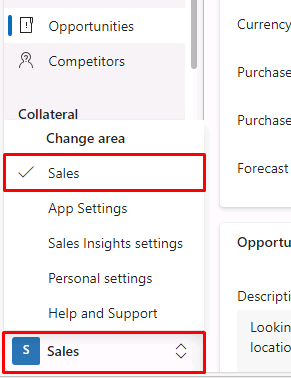
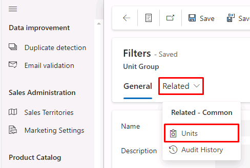
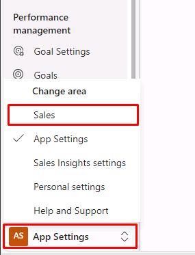
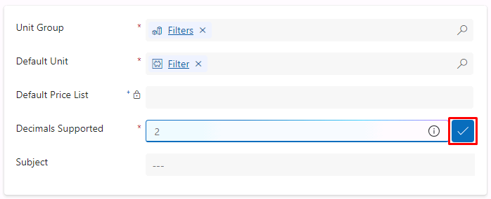
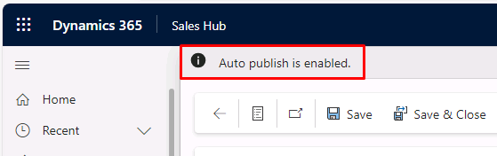

---
lab:
    title: 'Lab 2: Configure the product catalog'
---

# TW-7003: Optimize sales processes with Dynamics 365 Sales

## Lab 2 – Manage product catalog

### Scenario
As Contoso Coffee grows, they are looking to standardize their pricing structure and allow for easier creation of quotes, orders, and invoices with more accurate pricing and product details. Contoso Coffee recently released its newest smart coffee machine. As a functional consultant on their Dynamics 365 Sales implementation, you have been asked to configure the product catalog.

Upon successful completion of this lab, you will be able to:
- Create unit groups
- Define price lists
- Create discount lists
- Define products and product families

### Exercise 1 – Product Catalog

#### Task 1 – Create Unit Group

In this task, you will create unit groups for a line of coffee machine filters.

1. Go to your Dynamics 365 Sales Hub application.

1. Select **Sales** (default option for the Change Area menu) in the lower-left, then select **App Settings**.

    

1. Under the **Product Catalog** section on the left menu, select **Unit Groups**.

1. Select **+ New** on the top command bar.

1. Enter the following information in **Create Unit Group**:

    - Name: **Filters**
    - Primary Unit: **Each** 

1. Once the Unit Group opens, select the **Related** tab, then select **Units**.

    

    You will find that you only have the default unit **Each** now. You will add three more units. 

1. Select **+ New Unit** at the top of the **Unit Group Units Associated View** section.

1. Enter the following information in **Quick Create: Unit**:

    - Name: **Filter**
    - Quantity: **1** 
    - Base Unit: **Each**

1. Select the **˅** dropdown icon to the right of the **Save and Close** button, then select **Save & Create New**.

1. Enter the following information:

    - Name: **Pack**
    - Quantity: **2** 
    - Base Unit: **Filter**

1. Select the **˅** dropdown icon, then select **Save & Create New**.

1. Enter the following information:

    - Name: **Value Pack**
    - Quantity: **2** 
    - Base Unit: **Pack**

1. Select **Save and Close**.

    You will now see the four unit groups in the list.

#### Task 2 – Create Discount List

In this task, you will create a Discount List for people that buy 15 or 20 or more filters. The 15 filters will get a 15% discount and 20 to 50 filters will get a 25% discount.

1. Under the **Product Catalog** section on the left menu, select **Discount Lists**.

1. Select **+ New** on the top command bar.

1. Use the following information for the **New Discount List**:

    - Name: **Quantity Discount**
    - Type: **Percentage** 

1. Select **Save** on the command bar.

1. Select the **Related** tab, then select **Discounts**.

1. Select **+ New Discount** at the top of the **Discount Associated View** section.

1. Enter the following information for the **New Discount List**:

    - Discount Type: **Quantity Discount**
    - Begin Quantity: **15** 
    - End Quantity: **19**
    - Percentage: **15**

1. Select **Save**.

1. Select **+ New** again.

1. Enter the following information:

    - Discount Type: **Quantity Discount**
    - Begin Quantity: **20** 
    - End Quantity: **50**
    - Percentage: **25**

1. Select **Save**.

#### Task 3 – Create Price List

In this task, you will create a price list for the filters.

1. Under the **Product Catalog** section on the left menu, select **Price Lists**.

1. Select **+ New** on the top command bar.

1. Enter *Filter Direct* for the **Name** field and select **US Dollar** for **Currency**.

1. Select **Save & Close**.

#### Task 4 – Create Products

In this task, you will create products.

1. Select **App Settings** on the Change Area menu in the lower-left, then select **Sales**.

    

1. Under the **Collateral** section on the left menu, select **Products**.

1. Select **Add Product** on the top command bar.

1. Use the following information for **Product: New Product**:

    - Name: **Airpot XL 6 Month Filter**
    - Product ID: **AXL6MF-1234**
    - Unit Group: **Filters**
    - Default Unit: **Filter**
    - Decimals Supported: **2** (Select blue check mark to accept suggestion)

    

1. Select **Save**.

1. Select the **Additional Details** tab.

1. At the top-right of the **Price List Items** section, select **+ New Price List Item**.

1. Enter the following information for **New Price List Item**:

    - Price List: **Filter Direct**
    - Discount List: **Quantity Discount**
    - Quantity Selling Option: **Whole**

1. Select the **Pricing Information** tab.

1. Enter *25* for **Amount**.

1. Select **Save & Close** in the command bar.

1. If Auto publish is enabled, skip this step. (Publish will not appear on the command bar.) Otherwise, select **Publish** and **Confirm** to publish the product.

    

1. Under the **Collateral** section on the left menu, select **Products**.

1. Select **Add Product** in the command bar.

1. Use the following information for **Product: New Product**:

    - Name: **Airpot XL Reservoir Extension**
    - Product ID: **AXLRE-4321**
    - Unit Group: **Default Unit**
    - Default Unit: **Primary Unit**
    - Decimals Supported: **2** (Select blue check mark)

1. Select **Save**.

1. Select the **Additional Details** tab.

1. At the top-right of the **Price List Items** section, select **+ New Price List Item**.

1. Enter the following for **New Price List Item**:

    - Price List: **Filter Direct**
    - Quantity Selling Option: **Whole**

1. Select the **Pricing Information** tab.

1. Enter *299* for **Amount**.

1. Select **Save & Close**.

1. If Auto publish is enabled, skip this step. Otherwise, select **Publish** and **Confirm** to publish the Product.
1. Select **Products** again in the left menu.

1. Select **Add Product**.

1. Use the following for **Product: New Product**:

    - Name: **Airpot XL Pot Extender**
    - Product ID: **AXPLE-7894**
    - Unit Group: **Default Unit**
    - Default Unit: **Primary Unit**
    - Decimals Supported: **2** (Select blue check mark)

1. Select **Save**.

1. Select the **Additional Details** tab.

1. At the top-right of the **Price List Items** section, select **+ New Price List Item**.

1. Enter the following for **New Price List Item**:

    - Price List: **Filter Direct**
    - Quantity Selling Option: **Whole**

1. Select the **Pricing Information** tab.

1. Enter *199* for **Amount**.

1. Select **Save & Close**.

1. If Auto publish is enabled, skip this step. Otherwise, select **Publish** and **Confirm** to publish the Product.

1. Select **Products** again in the left menu.

    The products you created will show up on the **All Products, Families & Bundles** view. You can switch to this view by selecting the **˅** dropdown icon next to the default view title. 
