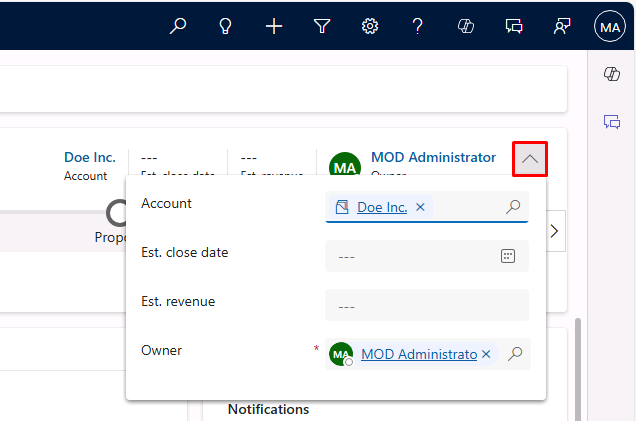
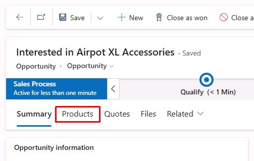
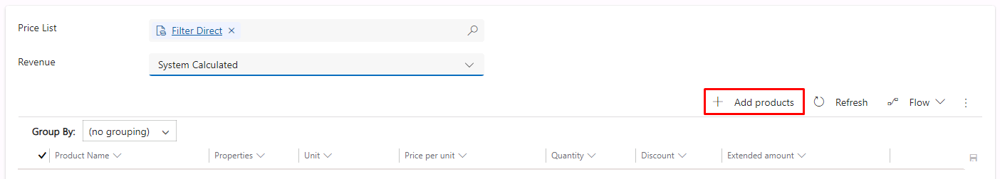
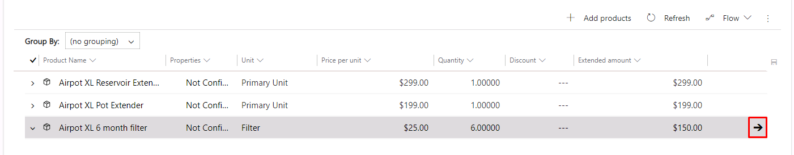
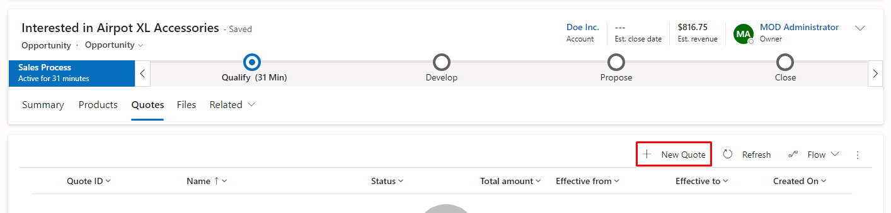
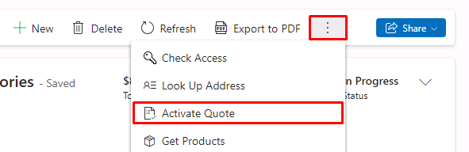

---
lab:
    title: 'Lab 3: Build quotes'
---

# TW-7003: Optimize sales processes with Dynamics 365 Sales

## Lab 3 – Build quotes

### Scenario
As a sales analyst for the Dynamics 365 Sales implementation at Contoso Coffee, you want to ensure that salespeople will be able to leverage the product catalog enhancements throughout the entire sales lifecycle. To ensure the functionality is working correctly, you'll test the process of building a quote from a new opportunity.

Upon successful completion of this lab, you'll be able to:
- Create opportunities and add opportunity line items
- Generate a quote from an opportunity

### Exercise 1 – Create a Quote

#### Task 1 – Add Products Line Items

In this task, you'll create an Opportunity and add Products Line Items.

1. Go to your Dynamics 365 Sales Hub application.

1. In the left menu, under the **Sales** section, select **Opportunities**.

1. Select **+ New** in the top command bar.

1. Enter in the **Opportunity information** section: 

    - Topic: **Interested in Airpot XL Accessories**
    - Contact: **Jon Doe**

1. In the Opportunity header at the top-right, select the **˅** dropdown icon next to the Owner field.

    

1. Enter and select **Doe Inc.** for **Account**.

1. Select **Save** on the command bar.

1. Select the **Products** tab.

    

1. You need to select a **Price List** before you can add Opportunity Products. Enter and select **Filter Direct**.

1. Select **System Calculated** for **Revenue**.

1. In the same section, down and to the right of that field, select **+ Add products**.

    

1. On the initial **All products** tab, find **Airpot XL 6 Month Filter**, enter *6* for **Quantity**, then select **Add**.

1. For **Airpot XL Pot Extender**, leave *1* for **Quantity**, then select **Add**.

1. For **Airpot XL Reservoir Extension**, leave *1* for **Quantity**, then select **Add**.
    
1. Select **Save to Opportunity**.

1. Hover over the **Airpot XL 6 Month Filter** product, and select the right arrow in the rightmost column to navigate to it.

    

1. Locate the **Volume Discount** field and note that there's no discount.

1. Enter *15* in the **Quantity** field.

    Select outside of the field. The discount will kick in and the **Volume Discount** field will show a new value.

1. Select **Save & Close** in the command bar.

#### Task 2 – Create Quote

In this task, you'll create a Quote from the Opportunity you created. 

1. In the same **Interested in Airpot XL Accessories** Opportunity, select the **Quotes** tab.

1. Select **+ New Quote** in the top-right of the Quotes section.

    

    The Quote form will open, and relevant information will be copied from the Opportunity.

1. On the Quote page, examine the **PRODUCTS** section and ensure the products and quantities are correct. You can change quantities and discount the price of each line item.

1. Select **Activate Quote** on the command bar.

    **Note:** You may need to select the ellipsis to see the option, depending on your window size/resolution.

    

1. Select **Export to PDF** on the command bar.

1. On the **Export to PDF** dialog, select **Print quote for customer** if not already selected, then select **Download** at the top-left.

1. Open the document and observe the details.

1. Close the PDF.

1. Close the **Export to PDF** dialog.

