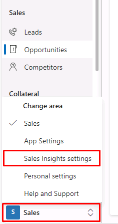
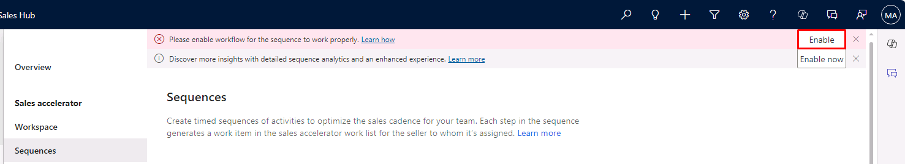
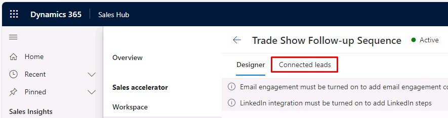
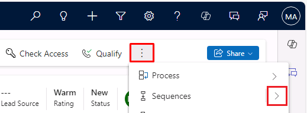
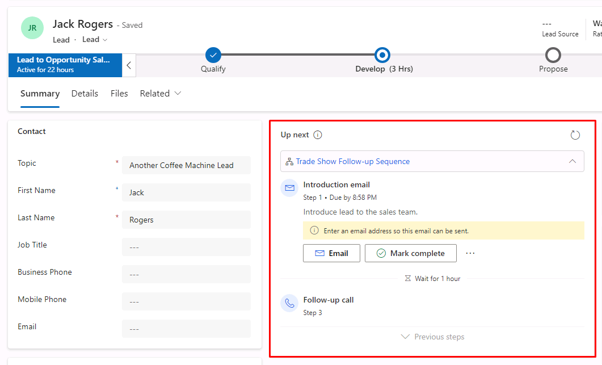

---
lab:
    title: 'Lab 5: Build a sequence'
---

# TW-7003: Optimize sales processes with Dynamics 365 Sales

## Lab 5: Build a sequence

### Scenario
Contoso Coffee’s sellers suggest that sales could be improved if organizational "best practices" were easier to follow. After examination, Contoso’s sales managers have determined an ideal sequence of sales events for sellers. They want to enforce best practices by setting up a series of consecutive activities for sellers to follow while qualifying leads. You want to ensure that it is as easy as possible for sellers to follow during their day. You have determined that a sequence is the best way to accomplish this.

Upon successful completion of this lab, you'll be able to:

-   Create a segment
-   Create a sequence
-   Define sequence activities
-   Activate and connect sequences to records

## Exercise 1: Create and attach Sequences to records

### Task 1: Enable Sales Accelerator

1. Select **Sales** on the Change Area menu in the lower-left, then select **Sales Insights settings**.

    

1. Under the **Sales accelerator** section, select the **Sequences** tab.

    You'll be asked to set up the Workspace to be able to use Sequences. 
    
1. Select the **Setup workspace** button.
    
1. Select the **Quick setup** button.

1. Under the **Record type and form** section, select **+ Add record type**. 

1. Select **Opportunities**.

1. For the default form for each record type, configure as follows:

    - Leads: **Sales Insights**
    - Opportunities: **Sales Insights**

1. Select the **Publish** button.

    **Alert:** It may take several minutes for your changes to be applied.

### Task 2: Create a Segment

1. Under the **Sales accelerator** section, select the **Work Assignment** tab.

1. Select **Next** through the tips.

1. Set **Record type** to **Leads**

1. Select the **New Segment** button.

1. In the **Name** field enter *Trade Show Leads* and then select the **Next** button.

1. On the default **Segment definition** tab, select the **Add** button, then select **Add row**.

1. Configure the condition as follows:

    - **Lead Source** – **Equals** – **Trade Show**

1.  Select **Simulate Results**.

    You'll see a segment member simulation screen which will include any leads that meet your criteria.

1. Close the **Segment member simulation** dialog.

1. Select the **Save** button in the top-right.

1. Select the **Activate** button in the top-right, then select **Activate** again in the dialog.

## Exercise 2: Create and attach Sequences to records

### Task 1: Create new sequence

1. Under the **Sales accelerator** section, select the **Sequences** tab.

1. If prompted, select **Enable** on the banner notification to enable workflow for sequences to work properly.

    

1. On the Sequences blade, select **+ New sequence**.
    
    You'll have the option to create a sequence from a number of common templates. You can explore the templates available. 
    
1. Select the **Start from blank** button at the bottom-right.

1. Assign a name, description, and the type of table that the sequence will be available for using the following:

    - Name: *Trade Show Follow-up Sequence*
    - Description: *This is a test sequence for Test Coffee. This sequence will be used for following up with potential customers after trade shows.*
    - Record type: **Lead**

1. Select **Next**.

### Task 2: Choose the first activity for seller to take

Choose the first step for your sellers to take. This can be either sending an email, making a phone call or add a task of your own. You'll start with an email.

1. Underneath the **Sequence start** node, select the **+** button to add an action or other element.

1. In the **Add an action** dialog, select on **Send an email**.

1. Enter the following in the **Email** pane:

    - Title: *Introduction email*
    - Description: *Introduce lead to the sales team.*

    **Note:** If email templates (table specific or global templates) are available in your organization, you can choose an email template. In this lab, you'll forego this and assume the seller will write their own introduction email.

1.  Select **Save** on the command bar.

### Task 3: Add additional activities for your seller to take

Add additional activities for your sellers to take in an ordered manner following the introduction email.

1. Under the new **Send an email** node, select the **+** button.

1. Select **Set wait time** to define a time-interval between activities.

1. In the **Wait** pane, set **Hours** to **1**.

1. Select **Save** on the command bar.

1. Under the **Set wait time** node, select the **+** button.

1. Select **Make a phone call**.

1. In the **Phone call** pane, enter *Follow-up call* for the **Title**, and optionally add a **Description**.

1. Select **Save**.

### Task 4: Activate the sequence

To make the sequence available for sellers to use, activate the sequence.

1. Select **Activate** on the command bar.

1. In the **Activate sequence?** dialog, select the **I understand** checkbox, then select **Activate**.

    Your sequence will display a green banner notification at the top telling you the sequence was successfully activated.

### Task 5: Connect the sequence to a segment

1. In **Trade Show Follow-up Sequence**, select the **Connected leads** tab.

    

1. Select **+ Connect Segments**.

1. In the **Connect segments** dialog, ensure the **Trade Show Leads** segment is selected, then select **Connect**.

### Task 6: Connect the sequence to record (From Record)

1. Select **Sales Insights settings** on the Change Area menu in the lower-left, then select **Sales**.

1. In the left pane, under the **Sales** group, select **Leads**.

1. Select **Jack Rogers** to open the lead you created earlier.

1. On the command bar, select the arrow to the right of **Sequences**, then select **Connect sequence**.

    **Note:** You may need to select the ellipsis to see the option, depending on your window size/resolution.

    

1. In the **Connect lead to sequence** dialog, select **Trade Show Follow-up Sequence** from the list, then select **Connect**.

    A confirmation message appears at the bottom of the page, and the sequence is connected to the selected lead record.

1. If prompted to assign a seller, select the **Assign** button. 

    The seller(s) who have access to the lead record can see the activities connected with it.

1. In the **Up next** section, you'll now see the tasks you created.

    

